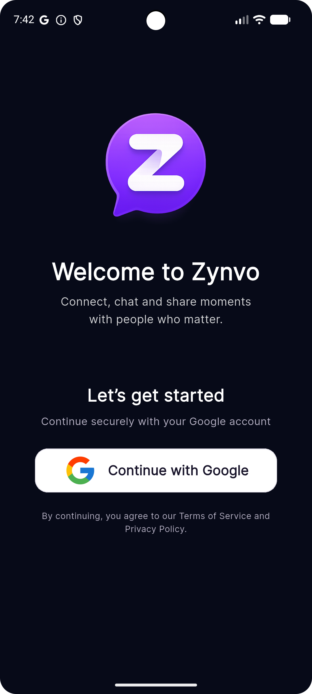
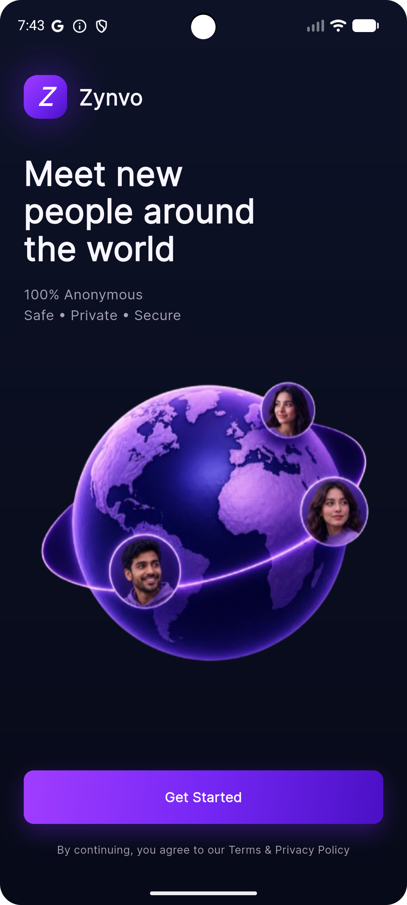
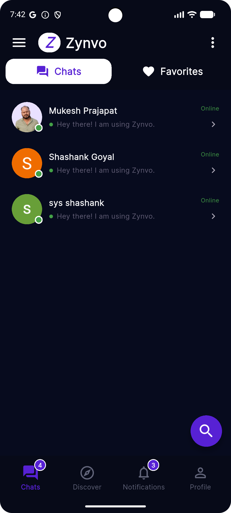
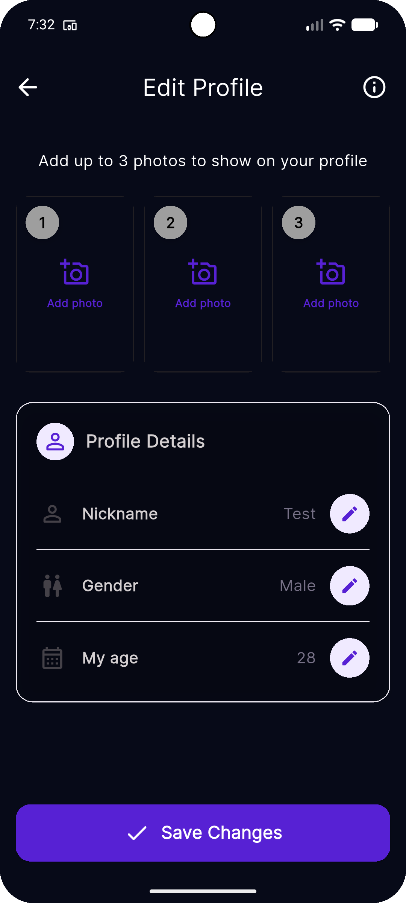

# 💜 Zynvo

### Anonymous Social Chat Platform

**Meet. Chat. Connect. Anonymously.**

Zynvo is a privacy-focused social chat platform that allows users to discover and connect with new people anonymously.

Users can find compatible people based on age and gender preferences and communicate through **text messages, voice messages, and image sharing** while controlling which profile information they reveal.

> 🚧 **Status:** Currently in active development.

---

## ✨ Features

### 👤 Anonymous Profiles

Users can create a profile with:

* Name
* Age
* Gender
* Profile picture
* Matching preferences

Users can also control which profile information is visible to other users.

### 🔐 Privacy Controls

Users can choose to show or hide:

* Name
* Age
* Gender
* Profile picture

When information is hidden, other users see:

```text
Anonymous User
Anonymous Avatar
Hidden age
Hidden gender
```

### 🎯 User Matching

Zynvo automatically searches for users based on selected preferences.

Default preferences:

| Setting         | Default       |
| --------------- | ------------- |
| Age             | 18            |
| Age preference  | 18–46         |
| Interested in   | Male + Female |
| Name            | Anonymous     |
| Profile picture | Optional      |

Only users between **18 and 100 years old** are allowed on the platform.

### 💬 Chat

Users can communicate through:

* 💬 Text messages
* 🎤 Voice messages
* 🖼️ Image sharing

Users can also:

* ⏭️ Skip a user
* ❤️ Favorite a user
* 🚫 Block a user
* 🚩 Report a user
* 🕘 View chat history

---

## 🛡️ Safety & Moderation

Zynvo includes features designed to provide a safer communication environment.

* User blocking
* User reporting
* Anonymous profile visibility
* Age restriction
* Admin user management
* Account status management
* Soft deletion
* Moderation capabilities

---

## 🖥️ Admin Panel

Zynvo includes a Laravel-based admin panel for managing the platform.

### Admin capabilities

* 🔐 Admin authentication
* 👥 User management
* 🚫 Blocked users
* 🚩 User reports
* 👤 Profile management
* 📊 Platform management
* 🛡️ Moderation

### Admin authentication

The admin panel uses Laravel's session-based `web` authentication guard.

The mobile API uses a separate JWT-based `api` guard.

This keeps browser authentication and mobile API authentication separated.

---

## 🏗️ Architecture

```text
                    ┌──────────────────────┐
                    │     Android App      │
                    │                      │
                    │  Profile             │
                    │  Discovery           │
                    │  Chat                │
                    │  Favorites           │
                    └──────────┬───────────┘
                               │
                               │ REST API
                               ▼
                    ┌──────────────────────┐
                    │    Laravel API       │
                    │                      │
                    │ Authentication       │
                    │ User Management      │
                    │ Discovery            │
                    │ Chat                 │
                    │ Media                │
                    └──────────┬───────────┘
                               │
             ┌─────────────────┼─────────────────┐
             ▼                 ▼                 ▼
       ┌───────────┐     ┌────────────┐    ┌───────────┐
       │   MySQL   │     │  Storage   │    │ Firebase  │
       │ Database  │     │   Media    │    │ Services  │
       └───────────┘     └────────────┘    └───────────┘


                    ┌──────────────────────┐
                    │    Laravel Admin     │
                    │                      │
                    │ User Management      │
                    │ Reports              │
                    │ Moderation           │
                    └──────────────────────┘
```

---

## 🌐 Application Domains

| Component | Domain                      |
| --------- | --------------------------- |
| Frontend  | `zynvo.syslotech.com`       |
| API       | `zynvo-api.syslotech.com`   |
| Admin     | `zynvo-admin.syslotech.com` |

---

## 🛠️ Technology Stack

### Backend

* **Laravel**
* **PHP**
* **MySQL**
* **REST API**
* **JWT Authentication**
* **Laravel Session Authentication**

### Mobile

* **Android**
* Google Authentication
* REST API
* Image upload
* Voice message upload

### Services

* Firebase
* Cloud/media storage
* Push notifications
* API-based services

---

## 🔑 Authentication

Zynvo uses separate authentication strategies for different application components.

### Admin / Web

```text
Browser
   ↓
Laravel Web Guard
   ↓
Session
   ↓
Users Table
```

### Mobile API

```text
Android App
   ↓
REST API
   ↓
JWT Authentication
   ↓
Users Table
```

The default Laravel authentication guard is `web` for browser-based authentication, while API requests explicitly use the `api` guard.

---

## 🗄️ Database

The application uses MySQL as its primary database.

The main `users` table contains account information such as:

```text
users
├── id
├── uid
├── name
├── email
├── password
├── phoneNumber
├── photoUrl
├── gender
├── status
├── user_type
├── is_blocked
├── is_deleted
├── deleted_by
├── profileSetupCompleted
├── profileCompletedAt
├── lastLoginAt
├── created_at
├── updated_at
└── deleted_at
```

Additional tables are used for profiles, conversations, messages, favorites, blocked users, reports, and application data.

---

## 🔒 Privacy

Privacy is a core part of the Zynvo experience.

Users have control over their public profile information.

### Visibility settings

```text
Show / Hide Name
Show / Hide Age
Show / Hide Gender
Show / Hide Profile Picture
```

Hidden information is replaced with anonymous placeholders when viewed by another user.

---

## 🔍 User Discovery Flow

```text
Google Login
     │
     ▼
Load Profile
     │
     ▼
Set Preferences
     │
     ▼
Search Compatible Users
     │
     ▼
User Found
     │
     ├──────────────┐
     ▼              ▼
   Chat            Skip
     │              │
     │              └──────► Search Again
     │
     ▼
Text / Voice / Image
     │
     ├────► Favorite
     ├────► Block
     └────► Report
```

---

## 📱 Screens

The public case study repository contains selected screenshots of the application.

### Login



### User Discovery



### Chat



### Chat List


### Profile



### Admin Panel


> Screenshot files will be added as the project documentation is finalized.

---

## 🗺️ Development Roadmap

### Phase 1 — Foundation

* [x] Laravel backend
* [x] MySQL database
* [x] Domain structure
* [x] User authentication
* [x] Admin authentication
* [x] Admin panel foundation

### Phase 2 — Profile

* [x] Name
* [x] Age
* [x] Gender
* [x] Profile picture
* [x] Privacy settings
* [x] Matching preferences

### Phase 3 — Discovery

* [ ] User matching
* [ ] Age filtering
* [ ] Gender filtering
* [ ] Automatic discovery
* [ ] Skip functionality
* [ ] Blocked-user filtering

### Phase 4 — Messaging

* [ ] Text messages
* [ ] Voice messages
* [ ] Image sharing
* [ ] Chat history
* [ ] Favorites
* [ ] Message status
* [ ] Typing indicator

### Phase 5 — Safety

* [ ] Block system
* [ ] Report system
* [ ] Admin moderation
* [ ] User restrictions
* [ ] Abuse detection

### Phase 6 — Production

* [ ] Push notifications
* [ ] Performance optimization
* [ ] Media optimization
* [ ] Monitoring
* [ ] Analytics
* [ ] Google Play release

---

## 📂 Case Study Structure

```text
zynvo-case-study/
│
├── README.md
│
├── docs/
│   ├── case-study.md
│   ├── architecture.md
│   ├── database.md
│   ├── api.md
│   ├── admin-panel.md
│   ├── privacy.md
│   └── roadmap.md
│
├── screenshots/
│   ├── login.png
│   ├── discovery.png
│   ├── chat.png
│   ├── chat-list.png
│   ├── profile.png
│   └── admin-dashboard.png
│
└── LICENSE
```

---

## 🎯 Project Goals

Zynvo is being developed with the following goals:

* Provide simple anonymous communication
* Make discovering new people easy
* Give users control over profile visibility
* Provide multiple communication methods
* Build safety and moderation into the platform
* Create a scalable backend architecture
* Provide a clean and modern mobile experience

---

## 🔐 Security Considerations

The project considers security throughout the application architecture.

* Password hashing
* Laravel session authentication
* JWT API authentication
* CSRF protection
* Input validation
* Authentication middleware
* Admin authorization
* User blocking
* User reporting
* Soft deletion
* Secure media handling
* Adult-only age restriction

> Production credentials, API keys, Firebase private keys, database credentials, JWT secrets, and `.env` files are intentionally excluded from this public repository.

---

## 🚧 Project Status

**Active Development**

Zynvo is currently under development. Features, architecture, database structure, and UI may evolve as development continues.

---

## 👨‍💻 Developer

### Mukesh Prajapat

Full Stack Developer specializing in:

* Laravel
* PHP
* Shopify
* WordPress
* REST APIs
* JavaScript
* React
* Mobile application backends
* API integrations
* Payment integrations

---

## 📄 License

This repository contains project documentation and case-study materials for Zynvo.

The actual Zynvo application source code is maintained separately in a private repository.

---

## ⭐ About Zynvo

**Zynvo — Meet. Chat. Connect. Anonymously.**

A privacy-focused social chat platform built around anonymous discovery, meaningful conversations, and user-controlled profile visibility.
